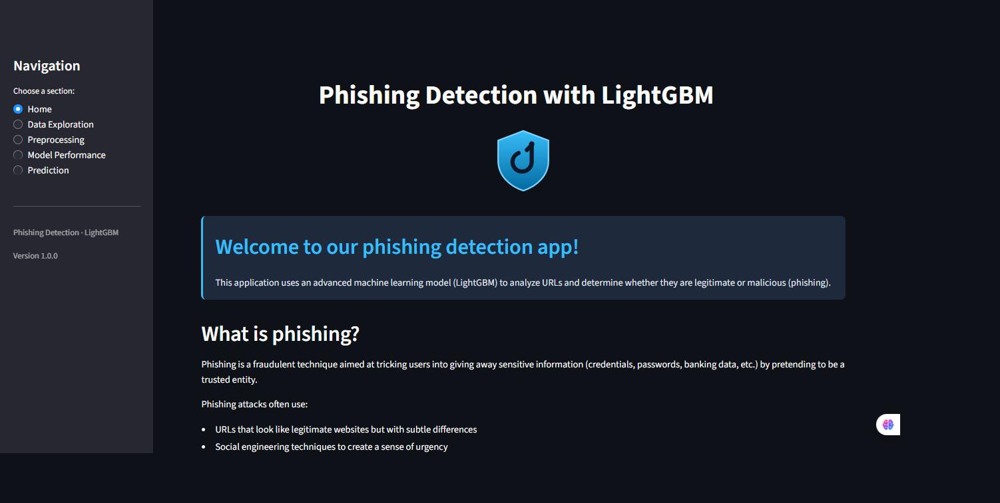

# Phishing URL Detection

A Streamlit application that classifies URLs as **phishing** or **legitimate** using a
LightGBM model trained on ~101,000 labelled URLs, reaching **99.05% accuracy** and
**0.999 ROC-AUC** on a held-out test set.

Paste a URL and the app extracts 23 features from its structure, its domain
registration and the HTML it serves, scores them, and — crucially — explains
which factors drove the verdict.




---

## Results

Measured on a held-out test set of 20,581 URLs.

| Metric | Score |
|---|---|
| Accuracy | **99.05%** |
| Precision | **99.31%** |
| Recall | **98.79%** |
| F1 score | **99.05%** |
| ROC-AUC | **0.9991** |
| PR-AUC | **0.9993** |

**Confusion matrix**

|  | Predicted legitimate | Predicted phishing |
|---|---|---|
| **Actually legitimate** | 10,220 | 71 |
| **Actually phishing** | 124 | 10,166 |

In practice: 71 legitimate sites out of 10,291 were wrongly flagged, and 124
phishing sites out of 10,290 slipped through.

---

## Features

- **Real-time URL analysis** — enter any URL and get a scored verdict with a
  legitimacy gauge.
- **Explained predictions** — the app lists the specific signals behind each
  verdict (unsecured password form, obfuscated characters, shortened link…)
  rather than emitting an unexplained score.
- **Data exploration** — class balance, distributions and correlations across
  the training dataset.
- **Preprocessing walkthrough** — what each pipeline stage does and why.
- **Model performance** — confusion matrix, ROC and precision-recall curves, and
  feature importances, all read from the trained bundle.
- **Graceful degradation** — when a page cannot be fetched, missing features are
  recovered from external services or fall back to neutral defaults, so an
  unreachable host never breaks a prediction.

---

## Quickstart

```bash
git clone https://github.com/Nejmeddin/phishing_detection_app.git
cd phishing_detection_app

python -m venv .venv
source .venv/bin/activate        # Windows: .venv\Scripts\activate

pip install -r requirements.txt
streamlit run main.py
```

The app opens at <http://localhost:8501>.

### Optional API keys

The app runs fully offline. Third-party lookups are only used to *recover*
features when a page cannot be fetched directly, and each one is optional:

```bash
cp .env.example .env    # then fill in whichever keys you have
```

| Variable | Service | Used for |
|---|---|---|
| `VIRUSTOTAL_API_KEY` | [VirusTotal](https://www.virustotal.com/) | Cached HTTP response for an unreachable page |
| `URLSCAN_API_KEY` | [urlscan.io](https://urlscan.io/) | Rendered page snapshot (works unauthenticated too) |
| `WHOISXML_API_KEY` | [WhoisXML](https://whois.whoisxmlapi.com/) | Domain registration age |

Without a key, that source is skipped rather than failing.

---

## How it works

```
URL
 │
 ├─ Lexical analysis ......... length, dots, subdomains, digits,
 │                             percent-encoding, shortener detection
 ├─ Domain analysis .......... WHOIS registration age
 ├─ Content analysis ......... fetch the page, inspect title, favicon,
 │                             forms, iframes, scripts, links
 │                                    │
 │                                    └─ unreachable? → enrichment fallbacks
 │                                       (VirusTotal → WhoisXML → urlscan →
 │                                        TLS probe → string-only → defaults)
 ├─ Preprocessing ............ PowerTransformer → StandardScaler → RFECV mask
 └─ LightGBM ................. 23 features → phishing probability → verdict
```

### Preprocessing pipeline

| Stage | Purpose |
|---|---|
| `PowerTransformer` | URL count features are heavily right-skewed; this makes them closer to normal |
| `StandardScaler` | Puts features measured on very different scales onto comparable footing |
| `IsolationForest` | Removes extreme outliers that would otherwise dominate the tree splits |
| `SMOTE` | Balances the classes so the model does not simply favour the majority |
| `RFECV` | Reduces the feature set to the 23 that carry the signal |

The fitted transformers travel inside the model bundle, so inference reproduces
the exact transformation order used during training.

---

## Project structure

```
phishing_detection_app/
├── main.py                      # Streamlit entry point and navigation
├── src/
│   ├── config.py                # Paths, credentials, feature metadata
│   ├── model/
│   │   └── model_loader.py      # Bundle loading, preprocessing, prediction
│   ├── preprocessing/
│   │   ├── feature_extractor.py # URL → feature vector
│   │   └── html_features.py     # Shared HTML parsing
│   └── utils/
│       └── feature_enrichment.py# Fallbacks for unreachable pages
├── views/                       # One module per Streamlit page
│   ├── home.py
│   ├── data_exploration.py
│   ├── preprocessing.py
│   ├── model_performance.py
│   ├── prediction.py
│   └── styles.py                # Single source of CSS
├── data/
│   ├── raw/                     # Training dataset
│   └── processed/               # Trained model bundle
├── tests/                       # pytest suite
└── .github/workflows/ci.yml     # Lint, format check, tests, secret scan
```

`views/` rather than `pages/` is deliberate: Streamlit treats a `pages/`
directory as an automatic multipage app, which would conflict with the
navigation this app builds itself.

---

## Development

```bash
pip install -r requirements-dev.txt

pytest                      # run the suite
pytest --cov=src            # with coverage
ruff check .                # lint
black .                     # format
```

The suite runs fully offline — every network call is mocked — and includes a
regression test that fails the build if an API key is ever hardcoded again.

---

## Limitations

Worth stating plainly:

- **Content features need a reachable page.** A host that blocks scrapers or is
  already offline yields defaults for 16 of the 23 features, which weakens the
  prediction. The verdict is least reliable exactly where it matters most.
- **The test score reflects the dataset, not the live web.** 99% on a curated
  balanced dataset does not translate directly to 99% against novel campaigns.
- **Fetching a suspicious URL is itself a request to a hostile server.** The app
  is a research and learning tool, not something to point at live threats from a
  machine you care about.
- **WHOIS lookups are slow and rate-limited**, adding several seconds to an
  analysis and sometimes failing outright.

---

## Dataset

101,063 labelled URLs (51,572 legitimate / 49,491 phishing) with 32 raw
attributes, reduced to 23 features by RFECV.

---

## License

[MIT](LICENSE)
